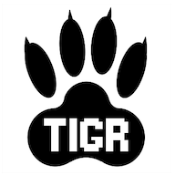
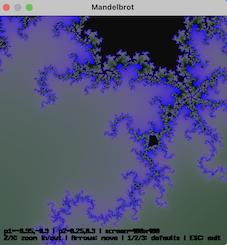
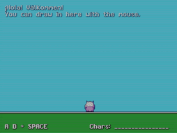
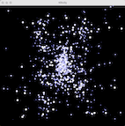

# Standard ML API for TIGR - the TIny GRaphics library






# sml-tigr [](https://github.com/diku-dk/sml-tigr/actions)

Standard ML package for interfacing with TIGR - the TIny GRaphics
library, which is a small graphics library that works on both Linux
and macOS platforms. In particular, this package contains bindings for
the [MLKit](https://github.com/melsman/mlkit) (> v4.7.8).

Notice that this repository **is a fork** of the repository for TIGR -
the [TIny GRaphics library](https://github.com/erkkah/tigr) - with an
added Standard ML API for the library.

## Overview of MLB files

- `lib/github.com/diku-dk/sml-tigr/tigr.mlb`:

  - **signature** [`TIGR`](lib/github.com/diku-dk/sml-tigr/tigr.sig)
  - **structure** `Tigr` : [`TIGR`](lib/github.com/diku-dk/sml-tigr/tigr.sig)

## Use of the package

The repository is set up to work well with the SML package manager
[smlpkg](https://github.com/diku-dk/smlpkg).  To use the package, in
the root of your project directory, execute the command:

```
$ smlpkg add github.com/diku-dk/sml-tigr
```

This command will add a _requirement_ (a line) to the `sml.pkg` file in your
project directory (and create the file, if there is no file `sml.pkg`
already).

To download the library into the directory
`lib/github.com/diku-dk/sml-tigr`, execute the command:

```
$ smlpkg sync
```

You can now reference the `mlb`-file using relative paths from within
your project's `mlb`-files.

Notice that you can choose either to treat the downloaded package as
part of your own project sources (vendoring) or you can add the
`sml.pkg` file to your project sources and make the `smlpkg sync`
command part of your build process.

Before compiling a project that uses `tigr.mlb`, the compilation
process must be set up first to generate a dynamic library for TIGR
(the file `libtigr.so`) and then to link with the dynamic library at
program launch. You may use the target `lib` in
[`Makefile`](./lib/github.com/diku-dk/sml-tigr/clib/Makefile) to
generate the `libtigr.so` dynamic library. To see an example of how to
setup MLKit to link with the dynamic library, consult
[`Makefile`](./sml-examples/mandel/Makefile).

## Standard ML Examples

Standard ML examples include the [hello](sml-examples/hello/hello.sml)
and [flags](sml-examples/flags/flags.sml) examples ported to Standard
ML from C, the [mandel](sml-examples/mandel/mandel.sml) example
demonstrating an interactive Mandelbrot viewer, the
[nbody](sml-examples/nbody/nbody.sml) example demonstrating an
interactive Nbody simulator, and the [ray](sml-examples/ray/ray.sml)
example demonstrating dynamic ray-tracing.

## The C Library (from https://github.com/erkkah/tigr)

TIGR is a tiny cross-platform graphics library, providing a unified
API for Windows, macOS, Linux, iOS and Android.

TIGR's core is a simple framebuffer library.  On top of that, TIGR
provides a few helpers for the common tasks that 2D programs generally
need:

 - Bitmap-backed windows.
 - Direct access to bitmaps, no locking.
 - Basic drawing helpers (plot, line, blitter).
 - Text output using bitmap fonts.
 - Mouse, touch and keyboard input.
 - PNG loading and saving.
 - Easy pixel shader access.

TIGR is designed to be small and independent.
The 'hello world' example is less than 100kB:

| *Platform* | *Size* |
| --- | --- |
| windows x86_64 | 48k |
| linux x86_64 | 43k |
| macOS arm64 | 90k |
| macOS x86_64 | 74k |

There are no additional libraries to include; everything is baked right into your program.

TIGR is free to copy with no restrictions; see [tigr.h](tigr.h).

## How do I program with TIGR?


Here's an example Hello World program in C. For more information, just
read [tigr.h](tigr.h) to see the APIs available.

```C
#include "tigr.h"

int main(int argc, char *argv[])
{
    Tigr *screen = tigrWindow(320, 240, "Hello", 0);
    while (!tigrClosed(screen))
    {
        tigrClear(screen, tigrRGB(0x80, 0x90, 0xa0));
        tigrPrint(screen, tfont, 120, 110, tigrRGB(0xff, 0xff, 0xff), "Hello, world.");
        tigrUpdate(screen);
    }
    tigrFree(screen);
    return 0;
}
```

## How to set up TIGR

### Desktop (Windows, macOS, Linux)

TIGR is supplied as a single .c and corresponding .h file.

To use it, you just drop them right into your project.

1. Grab  **tigr.c** and **tigr.h**
2. Throw them into your project.
3. Link with
    - -lopengl32 and -lgdi32 on Windows
    - -framework OpenGL and -framework Cocoa on macOS
    - -lGLU -lGL -lX11 on Linux
4. You're done!

### Android

Due to the complex lifecycle and packaging of Android apps
(there is no such thing as a single source file Android app),
a tiny wrapper around TIGR is needed. Still - the TIGR API stays the same!

To keep TIGR as tiny and focused as it is, the Android wrapper lives in a separate repo.

To get started on Android, head over to the [TIMOGR](https://github.com/erkkah/timogr) repo and continue there.

### iOS

On iOS, TIGR is implemented as an app delegate, which can be used in your app with just a few lines of code.

Building an iOS app usually requires quite a bit of tinkering in Xcode just to get up and running. To get up and running **fast**, there is an iOS starter project with a completely commandline-based tool chain, and VS Code configurations for debugging.

To get started on iOS, head over to the [TIMOGRiOS](https://github.com/erkkah/timogrios) repo and continue there.

> NOTE: TIGR is included in TIMOGR and TIMOGRiOS, there is no need to install TIGR separately.

## Fonts and shaders

### Custom fonts

TIGR comes with a built-in bitmap font, accessed by the `tfont` variable. Custom fonts can be loaded from bitmaps using `tigrLoadFont`. A font bitmap contains rows of characters separated by same-colored borders. TIGR assumes that the borders use the same color as the top-left pixel in the bitmap. Each character is assumed to be drawn in white on a transparent background to make tinting work.

Use the [tigrfont](https://github.com/erkkah/tigrfont) tool to create your own bitmap fonts from TTF or BDF font files.

Since TIGR version 3.1, unicode-encoded font sheets are supported, making it possible to render any glyph in your fonts. Text is still just rendered LTR, though.

### Custom pixel shaders

TIGR uses a built-in pixel shader that provides a couple of stock effects as controlled by `tigrSetPostFX`.
These stock effects can be replaced by calling `tigrSetPostShader` with a custom shader.
The custom shader is in the form of a shader function: `void fxShader(out vec4 color, in vec2 uv)` and has access to the four parameters from `tigrSetPostFX` as a `uniform vec4` called `parameters`.

See the [shader example](examples/shader/shader.c) for more details.

## Known issues

On macOS, seemingly depending on SDK version and if you use TIGR in an Xcode project, you need to define `OBJC_OLD_DISPATCH_PROTOTYPES` to avoid problems with `objc_msgSend` prototypes.
